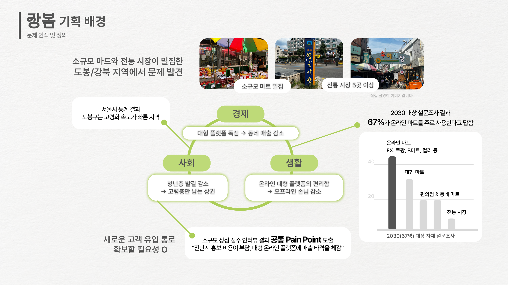
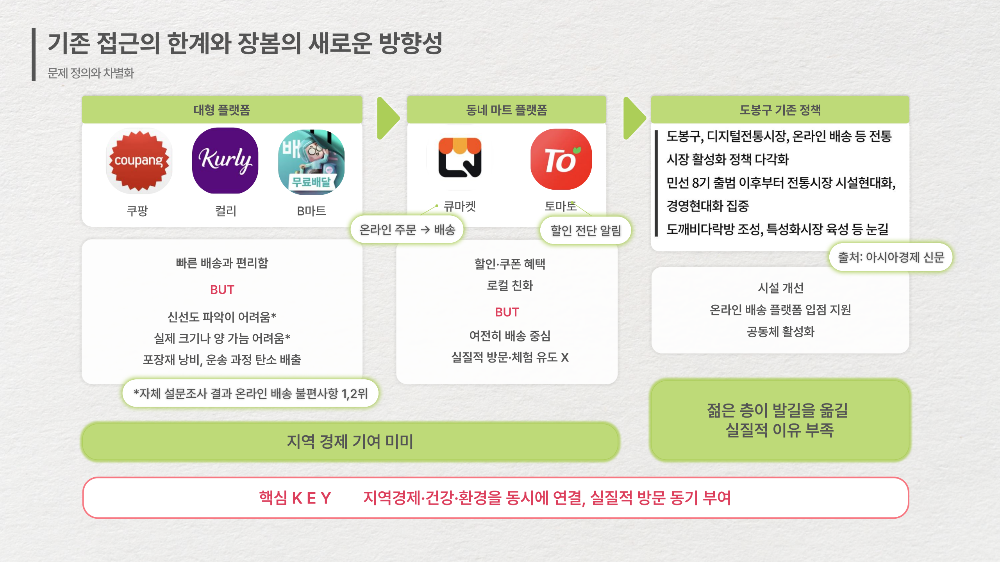
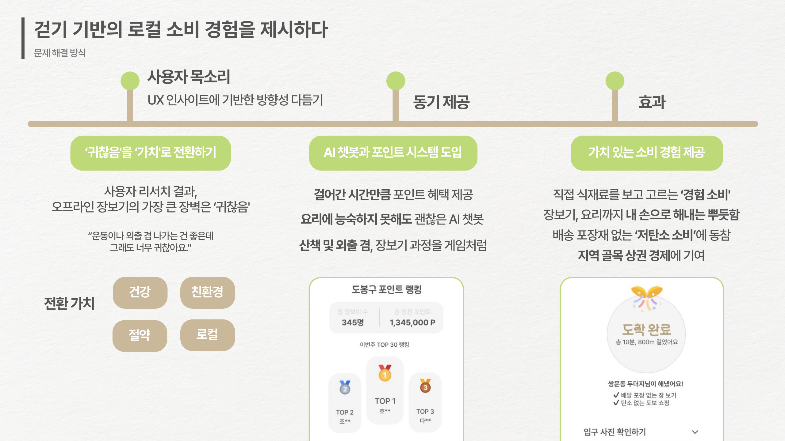
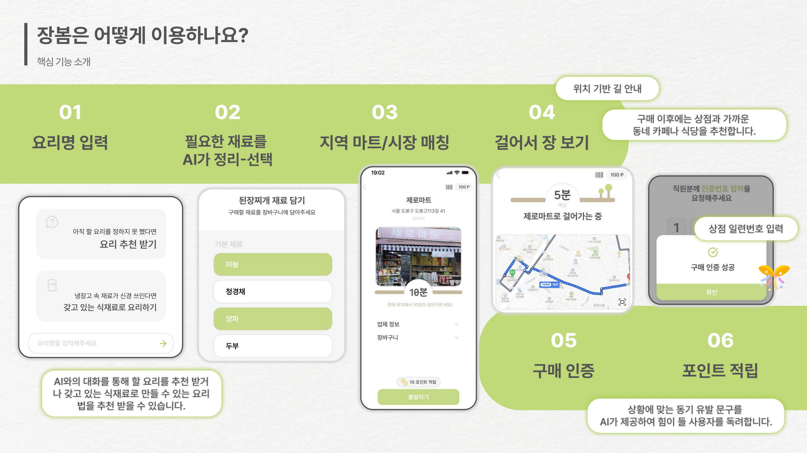
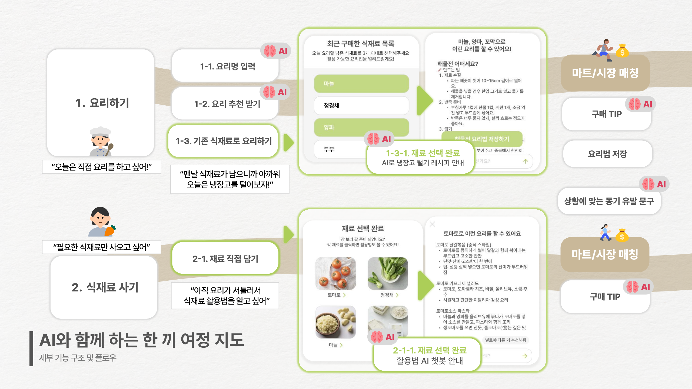
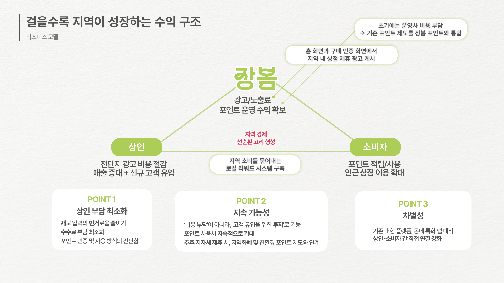
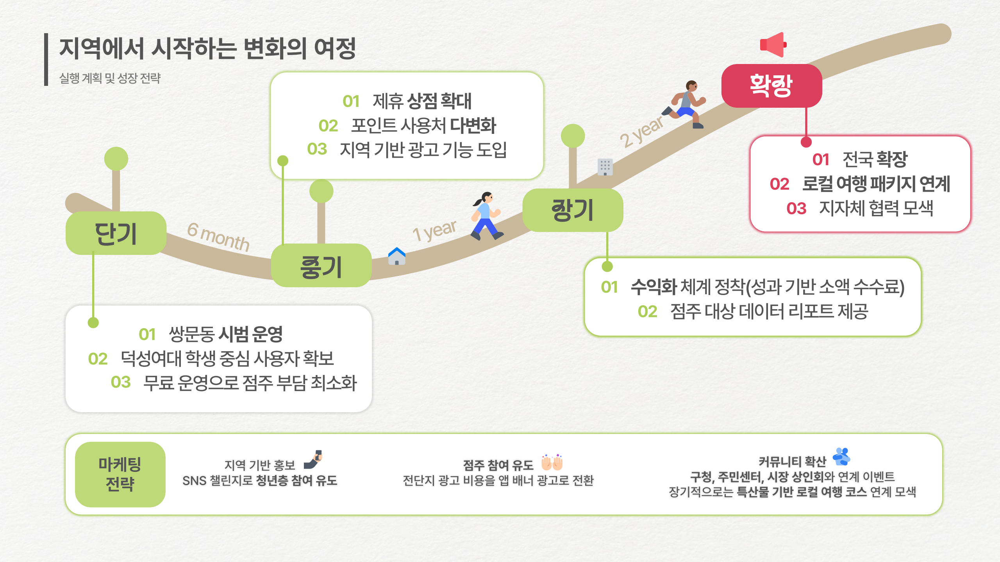

<div align="center">
  

"한 끼 식사의 여정을 모두 책임지는 동네 장보기 플랫폼"
</div>

  

---

## 🎤 서비스 소개
### 1️⃣ 장봄, 왜 지금 필요한가요?

최근 국내 중소형 마트와 전통시장은 대형 플랫폼 중심의 유통 구조 속에서 점차 경쟁력을 잃고 있고, 일부 지역에서는 고령화와 온라인 소비 확산으로 청년층의 오프라인 방문률이 급감하고 있습니다.

ITCO팀이 재학 중인 덕성여대 인근 도봉·강북 지역은 소규모 마트와 전통시장이 밀집해 있습니다. 하지만 서울시 통계에 따르면 이 지역은 고령화 속도가 빠르고, 실제 저희 조사에서도 **2030 세대의 67%가 온라인 마트를 주로 이용**한다고 답했습니다.

이로 인해 청년층 발길은 줄고, 고령층만 남은 상권이 되고 있습니다. 상인분들과 인터뷰한 결과, 공통적으로 ‘전단지 홍보 비용 부담’과 ‘대형 플랫폼에 의한 매출 타격’을 호소하셨습니다. 따라서 **새로운 고객 유입 통로 마련이 시급한 상황**입니다.

---

### 2️⃣ 기존 접근의 한계와 새로운 방향성

대형 플랫폼들은 빠른 배송을 강점으로 내세웠지만, 신선도 확인이 어렵고 소량 구매가 힘들며 포장재 낭비 문제를 안고 있습니다. 동네 마트 앱들도 등장했으나 여전히 배송 중심에 머물러 **실질적인 지역 기여가 없었습니다**.<br>지자체 역시 시설 개선이나 온라인 입점 지원에 치중했으나, 청년층이 직접 방문할 실질적 이유는 부족했습니다.

저희 장봄은 다릅니다. **배송이 아니라, 걷기 기반 방문 경험**을 중심으로 지역경제·건강·환경을 동시에 연결합니다.

---

### 3️⃣ 걷기 기반의 로컬 소비 경험을 제시하다

사용자 리서치에서 드러난 가장 큰 장벽은 ‘귀찮음’이었습니다. 저희는 이 귀찮음을 오히려 **가치로 전환**하고자 합니다.

1. **걸어간 시간을 포인트화**해 지역 내 랭킹 시스템으로 동기를 제공합니다.
2. **건강과 친환경 소비**를 연결합니다. 걸음 수를 칼로리로 환산하고, 배송 포장재를 줄이는 저탄소 소비로 이어집니다.
3. **AI가 한 끼 여정을 함께**합니다. 레시피 추천부터 남은 재료 활용까지 돕습니다.

이를 통해 장봄은 ‘가치 있는 소비 경험’을 제공합니다.

---

### 4️⃣ 장봄은 어떻게 이용하나요?

장봄은 장보기 과정을 게임처럼 즐길 수 있도록 설계했습니다.

1. **요리명 입력** : 사용자는 요리명을 입력하거나 AI에게 요리를 추천 받을 수 있습니다.
2. **필요한 재료를 AI가 정리·선택** : AI가 정리해준 재료를 확인하고 필요한 재료를 선택합니다.
3. **지역 마트/시장 매칭** : 재고가 있는 지역 마트와 시장으로 안내합니다.
4.  **걸어서 장 보기** : 길 안내를 따라 마트/시장으로 직접 걸어가 장을 봅니다.
5.  **구매 인증** : 마트/시장에 도착해 장 보기를 완료하면 상인에게 간단히 구매 인증을 받습니다.
6.  **포인트 적립** : 걸은 시간만큼 포인트를 적립합니다.

---

### 5️⃣ AI와 함께하는 한 끼 여정 지도

**1. AI 기반 요리·식재료 추천 및 활용**
- 요리명 기반 식재료 추천
사용자가 입력한 요리명 분석 → 필수 재료 / 선택 재료 자동 구분
직접 검색하지 않아도 우선순위 있는 장보기 리스트 확보
지역 마트에서 쉽게 구할 수 있는 식재료 위주로 추천

- 상황 맞춤 요리 추천
요리를 정하지 못한 경우, AI가 대화형으로 메뉴 추천
사용자의 상황·조건(시간, 인원, 분위기)에 맞는 요리 제안
선택된 요리는 ‘재료 담기’ → 곧바로 장보기 플로우와 연동

- 과거 구매 재료 기반 요리법 추천
구매 이력 기반 남은 재료 조합 → 새로운 요리법 제안
사용자는 입력 없이 ‘요리법 보관함’에 자동 저장 가능
남은 재료를 효율적으로 소비해 식재료 낭비 감소

- 선택 재료 활용법 제공
장바구니에서 특정 재료 클릭 시, 활용법·응용 요리 아이디어 제시
채팅 형식으로 대화하며 추가 조리법 확인 가능
재료 선택 → 활용법 확인 흐름으로 연결

**2. AI 기반 장보기 경험 향상**
- 식재료 구매 팁 제공
마트 도착 시 선택 재료의 신선도 확인법, 보관법 등 실시간 안내
검색 없이 바로 화면에서 확인 가능 → 장보기 편의성 증대
구매 과정에서 빠른 의사결정 지원

- 맞춤형 격려 메시지 제공
사용자가 직접 마트에 도착했을 때 AI가 상황 맞춤 메시지 출력
---
### 6️⃣ 걸을수록 지역이 성장하는 수익 구조

수익 모델은 **점주 부담 최소화**에 초점을 맞췄습니다.

1. 전단지 대신 앱 광고를 도입해 홍보비는 유지하면서 효율을 높입니다.
2.  포인트 제도는 기존 마트 포인트와 통합 운영합니다.<br>제휴 상점이 포인트를 미리 충전해 마케팅 비용처럼 활용할 수 있어 상인에게 실질적 혜택이 돌아갑니다.

소비자는 포인트와 건강한 혜택을 얻고, 상인은 새로운 고객과 매출을 얻으며, 장봄은 광고·포인트 운영 수익을 얻는 선순환 구조를 만듭니다.

---

### 7️⃣ 지역에서 시작하는 변화의 여정

실행 계획은 단계적으로 나눴습니다.

**단기**에는 쌍문동 시범 운영과 덕성여대 학생 중심 사용자 확보, 무료 운영으로 점주 부담을 최소화합니다.<br>**중기**에는 제휴 상점 확대와 포인트 사용처 다변화, 지역 광고 기능을 도입합니다.<br>**장기**에는 수익화 체계를 정착하고 점주 대상 데이터 리포트를 제공합니다.

**확장 단계**에서는 전국으로 확장해 로컬 여행 패키지와 연계, 지자체 협력까지 모색할 계획입니다.

---

## 💻 기술 스택
<span>프론트엔드: </span> 
 
 


<span>백엔드: </span>
 


<span>기획·디자인: </span> 


---

## 👩‍💻 팀원 소개
|손지수|이유정|양현빈|한연주|양서윤|
|:------:|:------:|:------:|:------:|:------:|
|기획 · 디자인|프론트엔드|프론트엔드|백엔드|백엔드|

---

## 📁 폴더 구조
```
.github/
├── workflows/
    └── deploy.yml
accounts/
├── __pycache__/
├── migrations/
├── templates/
│   └── accounts/
├── __init__.py
├── admin.py
├── apps.py
├── forms.py
├── models.py
├── tests.py
├── urls.py
├── utils.py
└── views.py
food/
├── __pycache__/
├── migrations/
├── templates/
│   └── food/
├── __init__.py
├── admin.py
├── apps.py
├── models.py
├── tests.py
├── urls.py
├── utils.py
└── views.py
jangbom/
├── __pycache__/
├── __init__.py
├── asgi.py
├── settings.py
├── urls.py
└── wsgi.py
market/
├── __pycache__/
├── integrations/
├── migrations/
├── services/
├── templates/
│   └── market/
├── __init__.py
├── admin.py
├── apps.py
├── models.py
├── tests.py
├── urls.py
├── utils.py
└── views.py
point/
├── __pycache__/
├── migrations/
├── templates/
│   └── point/
├── __init__.py
├── admin.py
├── apps.py
├── models.py
├── tests.py
├── urls.py
├── utils.py
└── views.py
static/
├── css/
├── img/
└── js/
manage.py  
README.md  
requirements.txt  

```

---
