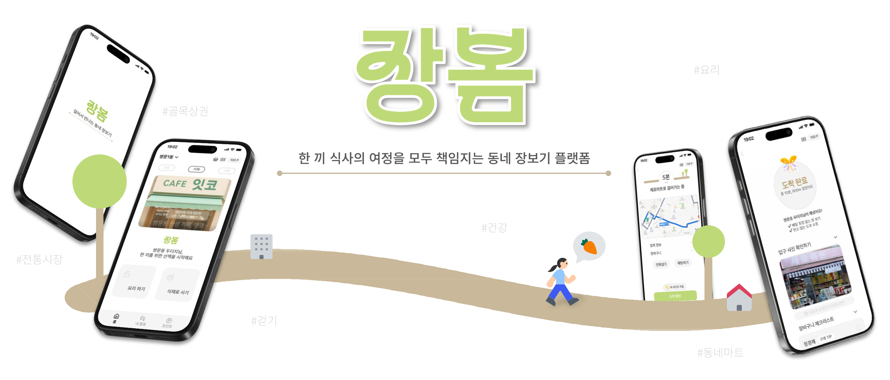

# 🛒 장봄
한 끼 식사의 여정을 모두 책임지는 동네 장보기 플랫폼



---

## 💖 서비스 슬로건
> **지역경제 · 건강 · 환경을 동시에 잇는 가치 있는 소비 경험**

---

## 🌟 서비스 소개
대형 플랫폼 의존과 골목 상권 침체 문제를 해결하기 위해,  
**배송이 아닌 걷기 기반 장보기 경험**을 제안합니다.

- **포인트 적립**: 상점까지 걸은 시간을 포인트로 전환, 지역 랭킹 제공  
- **건강·친환경**: 칼로리 환산 + 포장재 없는 저탄소 소비  
- **AI 기반 요리 지원**: 레시피 추천 → 재료 구매 → 남은 재료 활용까지 연결  

👉 귀찮음으로 외면받던 장보기를 **건강·재미·가치 있는 소비 경험**으로 전환합니다.

---

## ⚙️ AI 활용 기능
1️⃣ AI 기반 요리·식재료 추천 및 활용
- 🍳 (1) 요리명 기반 식재료 추천
사용자가 입력한 요리명 분석 → 필수 재료 / 선택 재료 자동 구분
직접 검색하지 않아도 우선순위 있는 장보기 리스트 확보
지역 마트에서 쉽게 구할 수 있는 식재료 위주로 추천

- 🥘 (2) 상황 맞춤 요리 추천
요리를 정하지 못한 경우, AI가 대화형으로 메뉴 추천
사용자의 상황·조건(시간, 인원, 분위기)에 맞는 요리 제안
선택된 요리는 ‘재료 담기’ → 곧바로 장보기 플로우와 연동

- 🥦 (3) 과거 구매 재료 기반 요리법 추천
구매 이력 기반 남은 재료 조합 → 새로운 요리법 제안
사용자는 입력 없이 ‘요리법 보관함’에 자동 저장 가능
남은 재료를 효율적으로 소비해 식재료 낭비 감소

- 🍅 (4) 선택 재료 활용법 제공
장바구니에서 특정 재료 클릭 시, 활용법·응용 요리 아이디어 제시
채팅 형식으로 대화하며 추가 조리법 확인 가능
재료 선택 → 활용법 확인 흐름으로 연결

2️⃣ AI 기반 장보기 경험 향상
- 🛍️ (1) 식재료 구매 팁 제공
마트 도착 시 선택 재료의 신선도 확인법, 보관법 등 실시간 안내
검색 없이 바로 화면에서 확인 가능 → 장보기 편의성 증대
구매 과정에서 빠른 의사결정 지원

- 💬 (2) 맞춤형 격려 메시지 제공
사용자가 직접 마트에 도착했을 때 AI가 상황 맞춤 메시지 출력

---

## 💻 기술 스택
<span>프론트엔드: </span> 
 
 


<span>백엔드: </span>
 


<span>기획·디자인: </span> 


---

## 👩‍💻 팀원 소개
|손지수|이유정|양현빈|한연주|양서윤|
|:------:|:------:|:------:|:------:|:------:|
| | | | | |
|기획 · 디자인|프론트엔드|프론트엔드|백엔드|백엔드|

---

## 📁 폴더 구조
```
.github/
├── workflows/
    └── deploy.yml
accounts/
├── __pycache__/
├── migrations/
├── templates/
│   └── accounts/
├── __init__.py
├── admin.py
├── apps.py
├── forms.py
├── models.py
├── tests.py
├── urls.py
├── utils.py
└── views.py
food/
├── __pycache__/
├── migrations/
├── templates/
│   └── food/
├── __init__.py
├── admin.py
├── apps.py
├── models.py
├── tests.py
├── urls.py
├── utils.py
└── views.py
jangbom/
├── __pycache__/
├── __init__.py
├── asgi.py
├── settings.py
├── urls.py
└── wsgi.py
market/
├── __pycache__/
├── integrations/
├── migrations/
├── services/
├── templates/
│   └── market/
├── __init__.py
├── admin.py
├── apps.py
├── models.py
├── tests.py
├── urls.py
├── utils.py
└── views.py
point/
├── __pycache__/
├── migrations/
├── templates/
│   └── point/
├── __init__.py
├── admin.py
├── apps.py
├── models.py
├── tests.py
├── urls.py
├── utils.py
└── views.py
static/
├── css/
├── img/
└── js/
.env  
.gitignore  
db.sqlite3  
manage.py  
README.md  
requirements.txt  

```

---
